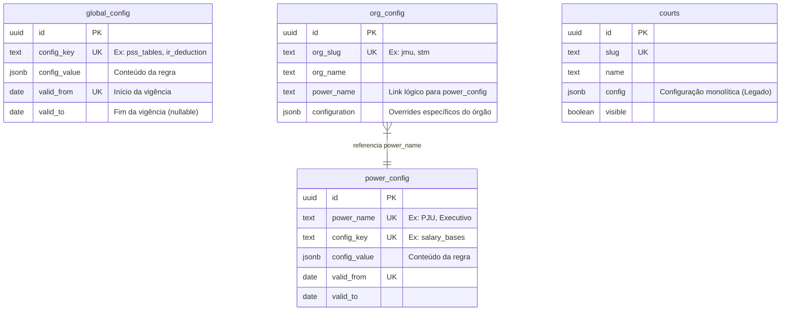

# Estrutura do Banco de Dados
Atualizado em: 25/01/2026

Este documento detalha a estrutura do banco de dados do projeto **Salário do Servidor**, hospedado no Supabase. O sistema utiliza uma arquitetura "Data-Driven" para gerenciar regras de negócio complexas e históricas (2024, 2025, 2026+) sem necessidade de redeploys constantes.

## Visão Geral

- **Banco de Dados**: PostgreSQL (via Supabase)
- **Arquitetura**: Configuração Hierárquica (Global -> Poder -> Órgão)
- **Segurança**: Row Level Security (RLS) Ativo

## Diagrama Relacional (ERD)



## Detalhamento das Tabelas

### 1. `global_config`
Configurações federais aplicáveis a todos os servidores, independentemente do órgão.
* **Finalidade**: Centralizar tabelas de impostos (IR, PSS) e deduções legais.
* **Colunas Importantes**:
    * `config_key`: Identificador da regra (ex: `pss_tables`).
    * `config_value`: JSON contendo a estrutura de dados (ex: faixas de alíquotas).
    * `valid_from`: Permite versionamento temporal (ex: tabela vigente a partir de Jan/2026).

### 2. `power_config`
Configurações específicas de um "Poder" ou carreira macro.
* **Finalidade**: Definir bases salariais, benefícios e gratificações comuns a uma carreira (ex: Analistas do PJU).
* **Colunas Importantes**:
    * `power_name`: Agrupador (ex: `PJU`).
    * `config_key`: Identificador (ex: `salary_bases` para vencimentos básicos).
    * `valid_from` / `valid_to`: versionamento temporal de regras (historico por vigencia).

**Chaves comuns em `power_config`**
- `salary_bases` (bases salariais e funcoes)
- `benefits` (auxilios)
- `cj1_integral_base` (base VR)
- `gratification_percentages` (GAJ/GAE/GAS)
- `aq_rules` (regras de adicional de qualificacao)

### 3. `org_config`
Cadastro dos órgãos disponíveis no simulador.
* **Finalidade**: Listar os órgãos (Tribunais) e vincular ao seu Poder regulador.
* **Colunas Importantes**:
    * `org_slug`: Identificador na URL (ex: `/simulador/jmu`).
    * `power_name`: Define de onde herdar as bases salariais (ex: `PJU`).
    * `configuration`: Campo JSON para regras exclusivas do órgão que fogem ao padrão do Poder.

### 4. `courts` (Legado / Fallback)
Tabela original do sistema.
* **Status**: Mantida para retrocompatibilidade. O sistema novo lê `org_config` e converte para o formato esperado pela UI, mas esta tabela ainda existe no banco.

## Políticas de Acesso (RLS)

O banco de dados utiliza **Row Level Security** para controlar acesso:

| Tabela | Operação | Permissão | Público Alvo |
| :--- | :--- | :--- | :--- |
| `*_config` | SELECT | **Pública** | Todos (Simulador Publico) |
| `*_config` | INSERT/UPDATE | **Restrito** | Apenas Admin / Service Role (No ambiente de Dev, pode estar liberado para Anon) |

## Estrutura dos JSONs (Exemplos)

### Tabela de PSS (`global_config`)
```json
{
  "2026": {
    "ceiling": 8475.55,
    "rates": [
      { "min": 0, "max": 1621.00, "rate": 0.075 },
      { "min": 1621.01, "max": 2902.84, "rate": 0.090 }
      // ...
    ]
  }
}
```

### Bases Salariais (`power_config`)
```json
{
  "analista": {
    "C13": 9292.14,
    "A1": 6188.61
  },
  "funcoes": {
    "fc1": 1215.34,
    "cj3": 10029.94
  }
}
```

### Regras de AQ (`power_config`)
Percentuais em decimal (ex: 0.01 = 1%).
```json
{
  "graduacao": 0.05,
  "treinamento_coef": 0.01,
  "treinamento_max": 0.03
}
```
