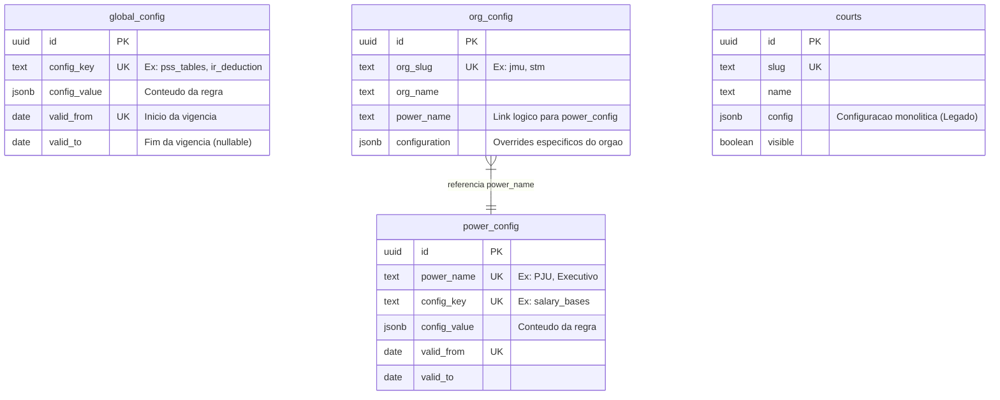

# Manual Tecnico - Salario do Servidor (v2.0)

## 1. Visao Geral do Produto
Plataforma Multi-Tenancy de Transparencia Salarial para simulacao de holerites do setor publico.
Objetivo: atender Tres Poderes (Executivo, Legislativo, Judiciario) em todas as esferas
(Federal, Estadual, Municipal), com regras e tabelas configuraveis por orgao.

Stack:
- React + Vite
- TypeScript
- Tailwind (Design System)
- Supabase (PostgreSQL + RLS)

## 2. Arquitetura de Dados (O Core)
O sistema e 100% Data-Driven. Nao existem valores hardcoded no codigo de calculo.
Todas as regras ficam no banco e sao combinadas por hierarquia.

### Hierarquia de Configuracao (Cascade Configuration)
1) Global (`global_config`): regras universais (IR, PSS, teto RGPS).
2) Poder/Regime (`power_config`): regras de carreira (ex: PJU, bases salariais, beneficios).
3) Orgao (`org_config`): overrides especificos do orgao (beneficios locais, ajustes).

### Diagrama Relacional (ERD)

### Notas de Seguranca (RLS)
- Tabelas `*_config` usam Row Level Security (RLS).
- SELECT e publico para o simulador.
- INSERT/UPDATE e restrito (admin/service role).

## 3. Arquitetura de Aplicacao (O Codigo)
### Cerebro (ConfigService)
`src/services/config/ConfigService.ts` busca configuracoes do Supabase e faz deep merge:
Global -> Power -> Org, gerando a EffectiveConfig.

### Motor (JmuService)
`src/services/agency/implementations/JmuService.ts` calcula o holerite com base
na configuracao final (sem valores hardcoded). Os modulos usam `params.agencyConfig`.

### Interface (Atomizada)
`src/components/Calculator/cards/` contem cards independentes:
- VacationCard
- ThirteenthCard
- SubstitutionCard
- OvertimeCard
- DailiesCard
- LicenseCard
- FoodAllowanceCard
- PreschoolCard

## 4. Guia de Manutencao e Atualizacao
### Cenario A (Novo Ano/IR)
Pergunta: "Onde atualizar a tabela de IR 2027?"
Resposta: `global_config` no Supabase (campo `config_value` da chave `ir_deduction`).

### Cenario B (Aumento Salarial)
Pergunta: "Onde lancar o reajuste de 8%?"
Resposta: `power_config` no Supabase (ex: `salary_bases` / `adjustment_schedule`).

### Cenario C (Novo Orgao)
Pergunta: "Como adicionar o TRF-1?"
Resposta: criar registro em `org_config` apontando para `power_name = 'PJU'`.
Se houver excecoes locais, use `configuration` para overrides.

## 5. Estrutura de Pastas e Comandos
Pastas chave:
- `src/services/agency/implementations/` (logica de calculo)
- `src/services/config/` (configuracao remota e merge)
- `src/components/Calculator/cards/` (cards atomicos)

Comandos uteis:
- `npm run dev` (rodar local)
- `npm run audit` (verificar integridade)
- `npm run typecheck` (validar TypeScript) *ou* `npx tsc --noEmit`

## 6. Referencias Tecnicas
- `DATABASE_SCHEMA.md` (detalhes do banco e ERD)
- `PROJECT_ARCHITECTURE.md` (arquitetura da aplicacao)
